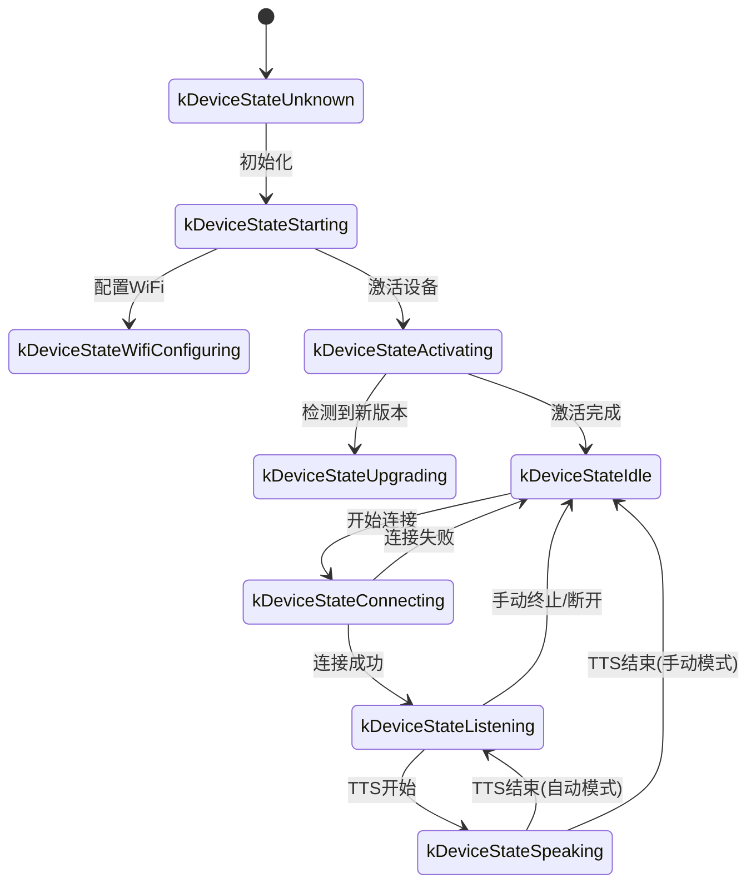

# 小智 ESP32 设备-服务器通信接口规范

> 本文档基于 `xiaozhi-esp32` 固件源码整理，用于服务端开发校验。  
> 涵盖所有设备与服务器之间的网络通信接口，包括 HTTP、WebSocket、MQTT、UDP、MCP 等。

---

## 目录

1. [通信总览](#1-通信总览)
2. [HTTP 接口](#2-http-接口)
3. [WebSocket 协议](#3-websocket-协议)
4. [MQTT + UDP 协议](#4-mqtt--udp-协议)
5. [MCP (Model Context Protocol)](#5-mcp-model-context-protocol)
6. [JSON 消息类型详表](#6-json-消息类型详表)
7. [二进制音频协议](#7-二进制音频协议)
8. [设备状态机](#8-设备状态机)
9. [附录：请求头规范](#9-附录请求头规范)

---

## 1. 通信总览

```
┌─────────────────────────────────────────────────────────────┐
│                        设备端 (ESP32)                        │
│  ┌─────────┐  ┌─────────────┐  ┌─────────────┐  ┌────────┐ │
│  │ OTA模块  │  │ WebSocket   │  │ MQTT+UDP    │  │  MCP   │ │
│  │ (HTTP)  │  │  语音通道    │  │  语音通道    │  │ 工具箱 │ │
│  └────┬────┘  └──────┬──────┘  └──────┬──────┘  └───┬────┘ │
│       │              │                 │             │      │
│       └──────────────┴─────────────────┴─────────────┘      │
│                                │                            │
│                         网络层 (WiFi/4G)                     │
└────────────────────────────────┼────────────────────────────┘
                                 │
                    ┌────────────┼────────────┐
                    ▼            ▼            ▼
              ┌─────────┐  ┌─────────┐  ┌─────────┐
              │ OTA服务  │  │ 语音服务 │  │ MCP网关  │
              │ (HTTP)  │  │ (WS/MQTT)│  │(JSON-RPC)│
              └─────────┘  └─────────┘  └─────────┘
```

### 1.1 通信矩阵

| 模块 | 协议 | 方向 | 用途 |
|------|------|------|------|
| OTA | HTTP | 设备→服务器 | 检查版本、设备激活、固件下载 |
| Assets | HTTP | 设备→服务器 | 资源包下载 |
| WebSocket | WebSocket | 双向 | 语音对话通道（JSON + 二进制音频） |
| MQTT | MQTT | 双向 | 控制信令通道 |
| UDP | UDP | 双向 | 音频数据传输（MQTT协议下） |
| MCP | WebSocket/MQTT载体 | 双向 | 工具发现与调用（JSON-RPC 2.0） |

---

## 2. HTTP 接口

### 2.1 OTA 版本检查

**请求**

```http
POST {ota_url} HTTP/1.1
Activation-Version: {1|2}          // 1=无序列号, 2=有序列号
Device-Id: {mac_address}            // 如: aa:bb:cc:dd:ee:ff
Client-Id: {uuid}                   // 软件UUID
Serial-Number: {serial}             // 可选, efuse中的序列号
User-Agent: {BOARD_NAME}/{version}  // 如: xiaozhi-esp32s3/1.2.0
Accept-Language: {zh|en|ja}
Content-Type: application/json

{device_system_info_json}           // Board::GetSystemInfoJson() 输出, 可能为空
```

> `ota_url` 读取优先级: NVS settings("wifi") → `CONFIG_OTA_URL` (编译配置)

**响应** (HTTP 200, JSON)

```json
{
  "firmware": {
    "version": "1.1.0",
    "url": "https://example.com/firmware.bin",
    "force": 0
  },
  "activation": {
    "message": "请激活设备",
    "code": "123456",
    "challenge": "abcdef...",
    "timeout_ms": 30000
  },
  "mqtt": {
    "endpoint": "mqtt.example.com:8883",
    "client_id": "xxx",
    "username": "xxx",
    "password": "xxx",
    "publish_topic": "device/xxx",
    "keepalive": 240
  },
  "websocket": {
    "url": "wss://voice.example.com/ws",
    "token": "xxx",
    "version": 1
  },
  "server_time": {
    "timestamp": 1715500000000,
    "timezone_offset": 480
  }
}
```

**响应字段说明**

| 字段 | 类型 | 必填 | 说明 |
|------|------|------|------|
| `firmware.version` | string | 否 | 新固件版本号 |
| `firmware.url` | string | 否 | 固件下载URL |
| `firmware.force` | int | 否 | 1=强制升级, 忽略版本比较 |
| `activation.message` | string | 否 | 激活提示消息 |
| `activation.code` | string | 否 | 激活码（数字） |
| `activation.challenge` | string | 否 | HMAC挑战字符串 |
| `activation.timeout_ms` | int | 否 | 激活超时时间 |
| `mqtt.*` | object | 否 | MQTT配置，存在则启用MQTT协议 |
| `websocket.*` | object | 否 | WebSocket配置，存在则启用WS协议 |
| `server_time.timestamp` | number | 否 | 服务器时间戳（毫秒） |
| `server_time.timezone_offset` | number | 否 | 时区偏移（分钟） |

> **优先级**: MQTT 配置存在则优先使用 MQTT；否则使用 WebSocket；两者皆无默认使用 MQTT。

---

### 2.2 OTA 固件下载

**请求**

```http
GET {firmware_url} HTTP/1.1
```

**响应**: 二进制固件数据 (HTTP 200)

> 设备通过 `Ota::Upgrade()` 下载并写入 OTA 分区，支持进度回调。

---

### 2.3 设备激活确认

设备显示激活码后，轮询此接口确认激活状态。

**请求**

```http
POST {ota_url}/activate HTTP/1.1
Activation-Version: {1|2}
Device-Id: {mac_address}
Client-Id: {uuid}
Serial-Number: {serial}
User-Agent: {BOARD_NAME}/{version}
Accept-Language: {zh|en|ja}
Content-Type: application/json

{
  "algorithm": "hmac-sha256",
  "serial_number": "...",
  "challenge": "...",
  "hmac": "..."
}
```

> `hmac` 使用 `esp_hmac_calculate(HMAC_KEY0, challenge)` 计算 SHA-256 结果。

**响应状态码**

| 状态码 | 含义 |
|--------|------|
| 200 | 激活成功 |
| 202 | 待确认（设备需继续轮询） |
| 其他 | 激活失败 |

---

### 2.4 资源包下载 (Assets)

**请求**

```http
GET {assets_download_url} HTTP/1.1
```

> `assets_download_url` 存储于 NVS settings("assets") 的 `download_url` 键。  
> 下载后写入 Flash 的 "assets" 分区，然后调用 `Assets::Apply()` 加载。

**响应**: 二进制资源包数据 (HTTP 200)

---

### 2.5 MCP 工具内部 HTTP 调用

MCP 工具 `self.screen.snapshot` 和 `self.screen.preview_image` 会发起 HTTP 请求：

#### 2.5.1 截图上传

```http
POST {url} HTTP/1.1
Content-Type: multipart/form-data; boundary=----ESP32_SCREEN_SNAPSHOT_BOUNDARY

------ESP32_SCREEN_SNAPSHOT_BOUNDARY
Content-Disposition: form-data; name="file"; filename="screenshot.jpg"
Content-Type: image/jpeg

{jpeg_binary_data}
------ESP32_SCREEN_SNAPSHOT_BOUNDARY--
```

#### 2.5.2 图片预览下载

```http
GET {url} HTTP/1.1
```

---

## 3. WebSocket 协议

### 3.1 连接建立

**握手请求头**

| 请求头 | 值 | 说明 |
|--------|-----|------|
| `Authorization` | `Bearer {token}` | 鉴权令牌，若无空格则自动加 Bearer 前缀 |
| `Protocol-Version` | `1`/`2`/`3` | 二进制协议版本 |
| `Device-Id` | `{mac}` | 设备 MAC 地址 |
| `Client-Id` | `{uuid}` | 软件生成的 UUID |

### 3.2 握手流程

```
设备                              服务器
  │ ────── WebSocket Connect ──────> │
  │ ────── {type: "hello"} ───────> │
  │ <───── {type: "hello"} ──────── │
  │                                  │
  │  ◄── 音频通道已打开 ──►         │
```

**设备 Hello** (JSON)

```json
{
  "type": "hello",
  "version": 1,
  "features": {
    "aec": true,
    "mcp": true
  },
  "transport": "websocket",
  "audio_params": {
    "format": "opus",
    "sample_rate": 16000,
    "channels": 1,
    "frame_duration": 60
  }
}
```

**服务器 Hello** (JSON)

```json
{
  "type": "hello",
  "transport": "websocket",
  "session_id": "sess_xxx",
  "audio_params": {
    "format": "opus",
    "sample_rate": 24000,
    "channels": 1,
    "frame_duration": 60
  }
}
```

> 服务器必须在 10 秒内响应 hello，否则设备判定连接超时。

### 3.3 音频传输

建立连接后，设备与服务器可双向传输二进制音频帧：

- **设备→服务器**: 麦克风采集 → OPUS 编码 → 二进制帧
- **服务器→设备**: 二进制帧 → OPUS 解码 → 扬声器播放

二进制帧格式见 [第7节](#7-二进制音频协议)。

---

## 4. MQTT + UDP 协议

### 4.1 MQTT 连接

**配置来源**: OTA 版本检查响应中的 `mqtt` 字段，持久化到 NVS settings("mqtt")。

| 参数 | 说明 |
|------|------|
| endpoint | MQTT 服务器地址，格式 `host:port`，默认端口 8883 |
| client_id | MQTT 客户端ID |
| username | MQTT 用户名 |
| password | MQTT 密码 |
| keepalive | 保活间隔，默认 240 秒 |
| publish_topic | 设备发布消息的主题 |

**断线重连**: 断开后 60 秒自动重连（`MQTT_RECONNECT_INTERVAL_MS`）。

### 4.2 音频通道 (MQTT + UDP)

MQTT 仅传输控制信令，音频数据通过 **UDP + AES-CTR 加密** 传输：

```
设备                              服务器
  │ ────── MQTT Connect ─────────> │
  │ ────── {type: "hello"} ──────> │ (MQTT Publish)
  │ <───── {type: "hello"} ─────── │ (MQTT Message)
  │                                  │
  │  从 hello 响应中提取:            │
  │    udp.server, udp.port        │
  │    udp.key, udp.nonce          │
  │                                  │
  │ ── UDP AES-CTR 加密音频 ─────> │
  │ <──── UDP AES-CTR 加密音频 ──── │
```

**设备 Hello** (MQTT Publish)

```json
{
  "type": "hello",
  "version": 3,
  "transport": "udp",
  "features": {
    "mcp": true
  },
  "audio_params": {
    "format": "opus",
    "sample_rate": 16000,
    "channels": 1,
    "frame_duration": 60
  }
}
```

**服务器 Hello** (MQTT Message)

```json
{
  "type": "hello",
  "transport": "udp",
  "session_id": "sess_xxx",
  "audio_params": {
    "format": "opus",
    "sample_rate": 24000,
    "channels": 1,
    "frame_duration": 60
  },
  "udp": {
    "server": "udp.example.com",
    "port": 8080,
    "key": "0123456789abcdef",
    "nonce": "fedcba9876543210"
  }
}
```

### 4.3 UDP 加密音频包格式

```
| type 1B | flags 1B | payload_len 2B | ssrc 4B | timestamp 4B | sequence 4B | payload ... |
```

- `type`: 固定 `0x01`
- `flags`: 保留
- `payload_len`: 负载长度（大端序）
- `ssrc`: 同步源标识
- `timestamp`: 时间戳（大端序）
- `sequence`: 序列号（大端序）
- 之后的数据使用 AES-CTR 加密

> AES-CTR 密钥: `udp.key` (128-bit hex字符串解码)  
> AES-CTR nonce: `udp.nonce` (128-bit hex字符串解码)

---

## 5. MCP (Model Context Protocol)

MCP 消息载体为 WebSocket 或 MQTT 的 JSON 消息，`type` 字段值为 `"mcp"`，`payload` 为 JSON-RPC 2.0 格式。

### 5.1 消息格式

```json
{
  "session_id": "sess_xxx",
  "type": "mcp",
  "payload": {
    "jsonrpc": "2.0",
    "id": 1,
    "method": "tools/list",
    "params": { ... }
  }
}
```

### 5.2 支持的 JSON-RPC 方法

| 方法 | 方向 | 说明 |
|------|------|------|
| `initialize` | 服务器→设备 | 初始化，设备返回协议版本和能力 |
| `tools/list` | 服务器→设备 | 获取工具列表 |
| `tools/call` | 服务器→设备 | 调用指定工具 |

### 5.3 设备端工具列表 (示例)

```json
{
  "tools": [
    {
      "name": "self.get_device_status",
      "description": "获取设备实时状态",
      "inputSchema": { "type": "object", "properties": {} }
    },
    {
      "name": "self.audio_speaker.set_volume",
      "description": "设置音量",
      "inputSchema": {
        "type": "object",
        "properties": {
          "volume": { "type": "integer", "minimum": 0, "maximum": 100 }
        },
        "required": ["volume"]
      }
    },
    {
      "name": "self.screen.set_brightness",
      "description": "设置屏幕亮度",
      "inputSchema": {
        "type": "object",
        "properties": {
          "brightness": { "type": "integer", "minimum": 0, "maximum": 100 }
        },
        "required": ["brightness"]
      }
    },
    {
      "name": "self.camera.take_photo",
      "description": "拍照并分析",
      "inputSchema": {
        "type": "object",
        "properties": {
          "question": { "type": "string" }
        },
        "required": ["question"]
      }
    },
    {
      "name": "self.reboot",
      "description": "重启系统",
      "inputSchema": { "type": "object", "properties": {} },
      "annotations": { "audience": ["user"] }
    },
    {
      "name": "self.upgrade_firmware",
      "description": "固件升级",
      "inputSchema": {
        "type": "object",
        "properties": {
          "url": { "type": "string" }
        },
        "required": ["url"]
      },
      "annotations": { "audience": ["user"] }
    }
  ]
}
```

### 5.4 工具调用响应格式

```json
{
  "jsonrpc": "2.0",
  "id": 1,
  "result": {
    "content": [
      { "type": "text", "text": "操作结果" }
    ],
    "isError": false
  }
}
```

### 5.5 能力协商 (initialize)

服务器可在 `initialize` 请求中下发 vision URL：

```json
{
  "jsonrpc": "2.0",
  "id": 0,
  "method": "initialize",
  "params": {
    "capabilities": {
      "vision": {
        "url": "https://vision.example.com/analyze",
        "token": "xxx"
      }
    }
  }
}
```

设备将其设置到 camera 模块，用于 `take_photo` 后的图片分析。

---

## 6. JSON 消息类型详表

### 6.1 设备 → 服务器

| type | state/mode | 字段 | 说明 |
|------|-----------|------|------|
| `hello` | - | `version`, `features`, `transport`, `audio_params` | 握手请求 |
| `listen` | `start` | `session_id`, `mode` (`auto`/`manual`/`realtime`) | 开始收音 |
| `listen` | `stop` | `session_id` | 停止收音 |
| `listen` | `detect` | `session_id`, `text` (唤醒词) | 唤醒词检测 |
| `abort` | - | `session_id`, `reason` (`wake_word_detected`) | 中止说话 |
| `mcp` | - | `session_id`, `payload` (JSON-RPC) | MCP 消息 |

### 6.2 服务器 → 设备

| type | state | 字段 | 说明 |
|------|-------|------|------|
| `hello` | - | `transport`, `session_id`, `audio_params` | 握手响应 |
| `tts` | `start` | `session_id` | 开始播放TTS |
| `tts` | `stop` | `session_id` | TTS结束 |
| `tts` | `sentence_start` | `session_id`, `text` | 句子开始，显示文本 |
| `stt` | - | `session_id`, `text` | 语音识别结果 |
| `llm` | - | `session_id`, `emotion`, `text` | 表情设置 |
| `mcp` | - | `session_id`, `payload` (JSON-RPC) | MCP 指令 |
| `system` | - | `session_id`, `command` (`reboot`) | 系统指令 |
| `alert` | - | `session_id`, `status`, `message`, `emotion` | 警告通知 |
| `goodbye` | - | `session_id` | 服务器主动关闭通道 (MQTT) |

---

## 7. 二进制音频协议

### 7.1 版本 1 (默认)

直接传输原始 OPUS 数据，无额外头。通过 WebSocket 的 binary/text 帧类型区分。

```
┌─────────────────────┐
│   OPUS Payload      │  (变长)
└─────────────────────┘
```

### 7.2 版本 2 (带时间戳)

```c
struct BinaryProtocol2 {
    uint16_t version;        // 协议版本 (大端序)
    uint16_t type;           // 0=OPUS, 1=JSON
    uint32_t reserved;       // 保留
    uint32_t timestamp;      // 时间戳毫秒 (大端序, 用于AEC)
    uint32_t payload_size;   // 负载大小 (大端序)
    uint8_t  payload[];      // 变长负载
} __attribute__((packed));
```

### 7.3 版本 3 (简化头)

```c
struct BinaryProtocol3 {
    uint8_t  type;           // 消息类型
    uint8_t  reserved;       // 保留
    uint16_t payload_size;   // 负载大小 (大端序)
    uint8_t  payload[];      // 变长负载
} __attribute__((packed));
```

### 7.4 音频参数默认值

| 参数 | 设备上行 | 服务器下行 |
|------|----------|------------|
| 格式 | opus | opus |
| 采样率 | 16000 Hz | 24000 Hz |
| 声道数 | 1 (单声道) | 1 (单声道) |
| 帧时长 | 60 ms | 60 ms |

---

## 8. 设备状态机



---

## 9. 附录：请求头规范

### 9.1 HTTP 通用请求头

| 请求头 | 来源 | 示例 |
|--------|------|------|
| `Activation-Version` | 有efuse序列号则为2，否则1 | `2` |
| `Device-Id` | `SystemInfo::GetMacAddress()` | `aa:bb:cc:dd:ee:ff` |
| `Client-Id` | `Board::GetUuid()` | `550e8400-e29b-41d4-a716-446655440000` |
| `Serial-Number` | efuse user_data (32字节) | `SN1234567890` |
| `User-Agent` | `{BOARD_NAME}/{version}` | `xiaozhi-esp32s3/1.2.0` |
| `Accept-Language` | 编译配置语言代码 | `zh` / `en` / `ja` |
| `Content-Type` | 固定值 | `application/json` |

### 9.2 WebSocket 握手请求头

| 请求头 | 来源 |
|--------|------|
| `Authorization` | `Bearer {settings.GetString("token")}` |
| `Protocol-Version` | `settings.GetInt("version")` 或默认 1 |
| `Device-Id` | MAC 地址 |
| `Client-Id` | UUID |

---

## 10. 校验清单

服务端实现请按以下清单逐项校验：

### HTTP 接口
- [ ] `POST {ota_url}` 返回 JSON，含 `firmware`/`mqtt`/`websocket`/`activation`/`server_time`
- [ ] `POST {ota_url}/activate` 支持 HMAC 挑战验证
- [ ] 固件下载接口返回二进制数据 (HTTP 200)
- [ ] 资源包下载接口返回二进制数据 (HTTP 200)

### WebSocket 接口
- [ ] 支持 `Authorization` 等自定义握手头
- [ ] 10秒内响应设备 `hello` 消息
- [ ] `hello` 响应必须含 `"type":"hello"` 和 `"transport":"websocket"`
- [ ] 支持 binary 帧传输 OPUS 音频
- [ ] 支持 text 帧传输 JSON 消息
- [ ] 支持协议版本 1/2/3 的二进制格式

### MQTT 接口
- [ ] 支持标准 MQTT 连接 (端口 8883)
- [ ] 通过 MQTT 消息传输 JSON 信令
- [ ] `hello` 响应含 `udp` 配置 (server, port, key, nonce)
- [ ] UDP 音频使用 AES-CTR 加密

### 消息类型
- [ ] 支持 `tts` (start/stop/sentence_start)
- [ ] 支持 `stt` (语音识别结果)
- [ ] 支持 `llm` (表情)
- [ ] 支持 `mcp` (JSON-RPC 2.0)
- [ ] 支持 `system` (reboot)
- [ ] 支持 `alert` (警告)
- [ ] 支持 `goodbye` (MQTT 断开)

### MCP 协议
- [ ] 支持 `initialize` 方法
- [ ] 支持 `tools/list` 方法
- [ ] 支持 `tools/call` 方法
- [ ] 正确处理 `withUserTools` 参数
- [ ] 支持分页 (cursor/nextCursor)
- [ ] 响应格式符合 JSON-RPC 2.0 规范

---

*文档版本: 基于固件源码 2025-05-12 整理*
