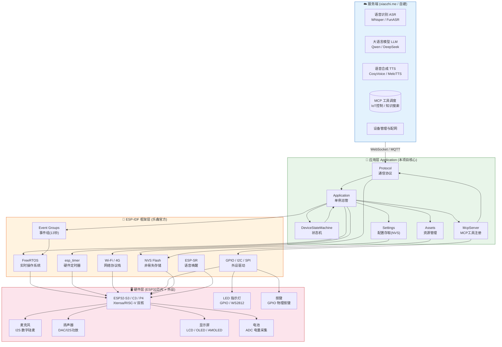

# 小智AI机器人 系统架构总图

> 此图展示项目四层架构：硬件层 → 框架层 → 应用层 → 服务端

## 整体架构层次

## 各层职责

| 层次 | 文件/组件 | 职责 |
|------|-----------|------|
| **硬件层** | ESP32芯片、麦克风、喇叭、屏幕 | 物理世界的输入输出 |
| **框架层** | FreeRTOS、ESP-IDF API | 提供操作系统能力、硬件抽象 |
| **应用层** | `application.cc`、`mcp_server.cc` 等 | 实现小智具体逻辑：状态管理、通信、设备控制 |
| **服务端** | xiaozhi.me 或自建服务器 | AI 处理：语音识别、大模型推理、语音合成 |
