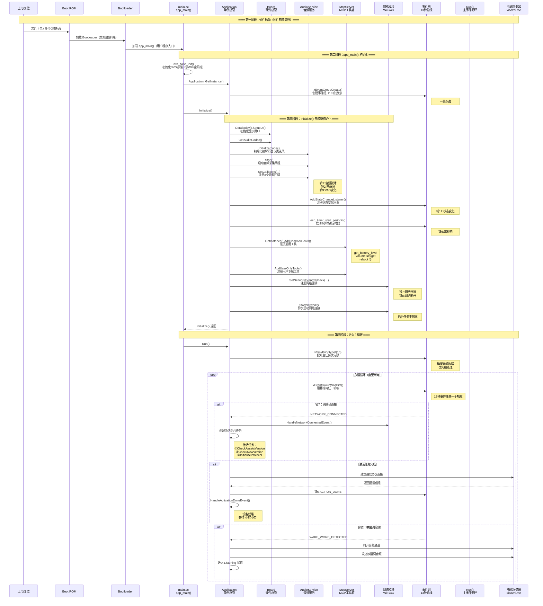

# 小智AI机器人 启动时序图

> 此图展示设备从上电复位到进入主事件循环的完整启动时序

## 启动流程（上电 → 主循环）

## 关键时间节点

| 时间点 | 事件 | 对应代码 |
|--------|------|----------|
| T+0s | 芯片上电 | Boot ROM 自动执行 |
| T+0.1s | Bootloader 启动 | 第二阶段引导 |
| T+0.3s | `app_main()` 入口 | `main.cc:14` |
| T+0.4s | 事件组、时钟创建 | `Application::Application()` |
| T+0.5s | 屏幕、音频、MCP初始化 | `Application::Initialize()` |
| T+0.6s | 网络异步连接开始 | `board.StartNetwork()` |
| T+0.7s | 进入主循环 `Run()` | `application.cc:165` |
| T+1~10s | 网络连接成功 | `HandleNetworkConnectedEvent()` |
| T+1~60s | 激活完成 | `HandleActivationDoneEvent()` |
| T+1s+ | 设备就绪，等待唤醒词 | Idle 状态 |
