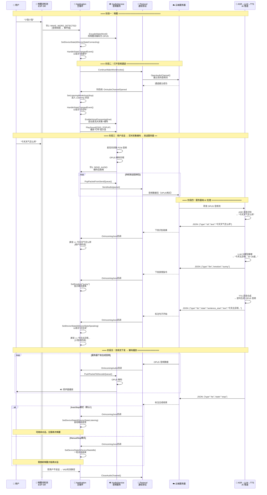

# 小智AI机器人 对话交互时序图

> 此图展示从唤醒词触发到完整一轮对话结束的交互流程

## 正常对话流程（唤醒 → 采集 → 识别 → 推理 → 合成 → 播放）

## 对话状态切换一览

| 状态 | 触发条件 | 行为 |
|------|----------|------|
| **Idle → Connecting** | 唤醒词 / 按键 | UI显示"连接中"，打开音频通道 |
| **Connecting → Listening** | 通道建立完毕 | 启动麦克风采集，发送OPUS音频 |
| **Listening → Speaking** | 服务器发来 `tts/state=start` | 停止采集，开始播放服务器音频 |
| **Speaking → Listening** | 服务器发来 `tts/state=stop` (AutoStop) | 自动恢复采集 |
| **Speaking → Idle** | 服务器发来 `tts/state=stop` (ManualStop) | 对话结束 |
| **Listening → Idle** | 按键关闭 / VAD静音超时 | 关闭音频通道 |
