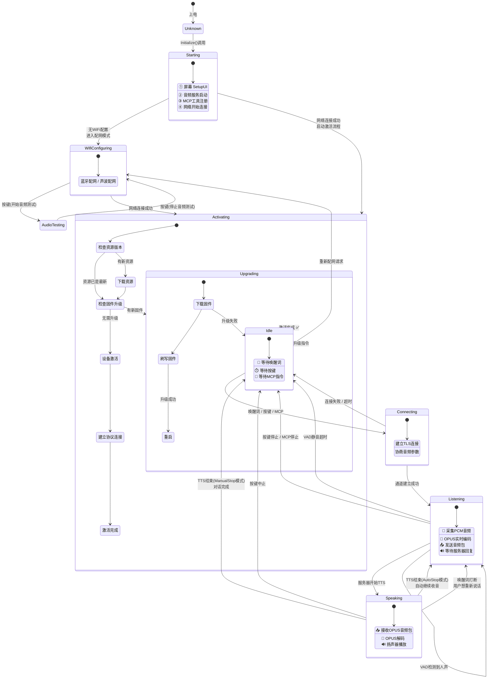

# 小智AI机器人 设备状态转移图

> 此图展示 DeviceStateMachine 管理的全部合法状态转移路径

## 完整状态转移图

## 各状态详解

| 状态 | 枚举值 | 描述 | 屏幕显示 |
|------|--------|------|----------|
| **Unknown** | `kDeviceStateUnknown` | 启动前默认状态 | - |
| **Starting** | `kDeviceStateStarting` | 系统初始化中 | "启动中..." |
| **WifiConfiguring** | `kDeviceStateWifiConfiguring` | Wi-Fi 配网模式 | "等待配网" |
| **AudioTesting** | `kDeviceStateAudioTesting` | 音频硬件测试 | "音频测试" |
| **Activating** | `kDeviceStateActivating` | 激活流程中（升级+鉴权） | "检查更新..." |
| **Idle** | `kDeviceStateIdle` | 待机就绪，等唤醒词 | "就绪" |
| **Connecting** | `kDeviceStateConnecting` | 正在打开音频通道 | "连接中..." |
| **Listening** | `kDeviceStateListening` | 正在收音（对话中） | "正在听..." |
| **Speaking** | `kDeviceStateSpeaking` | 正在播放AI回复 | "正在说..." |
| **Upgrading** | `kDeviceStateUpgrading` | 固件 OTA 升级中 | "升级中..." |

## 关键限制规则

| 规则 | 说明 |
|------|------|
| `Idle → Listening` 直接跳转 | **不允许**，必须先经过 `Connecting`（打开音频通道） |
| `Speaking → Listening` 自动跳转 | 仅在 AutoStop 模式下允许（AEC 关闭时默认） |
| `Listening → Speaking` 不被允许 | 状态切换由服务器 TTS 消息驱动，非设备主动 |
| 任何状态都可以 → `Upgrading` | 固件升级优先级最高 |
| `Upgrading → Idle` 仅失败时 | 升级成功则直接 `Reboot()`，不回到 Idle |
