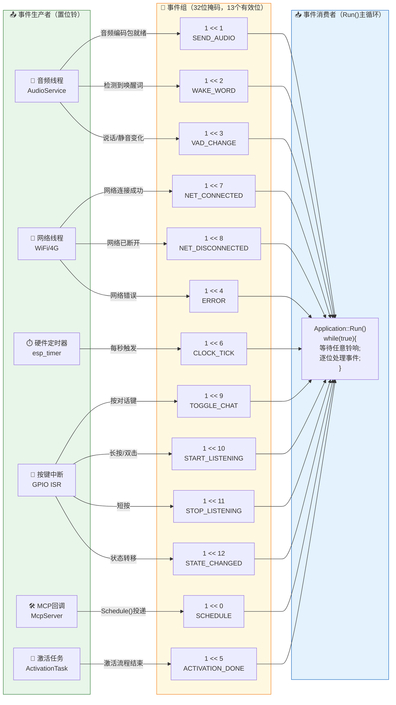

# 小智AI机器人 事件总线架构图

> FreeRTOS 事件组（Event Group）实现的事件驱动架构，共 **13 种事件**

## 13 铃事件总线全景



## 事件详表

| 铃号 | 宏定义 | 掩码 | 生产者 | 触发时机 | 消费者处理函数 |
|:--:|--------|------|--------|----------|---------------|
| 0 | `MAIN_EVENT_SCHEDULE` | `1<<0` | 任意线程 `Schedule()` | 有延迟任务需投递主线程 | 执行 `main_tasks_` 队列 |
| 1 | `MAIN_EVENT_SEND_AUDIO` | `1<<1` | AudioService 音频线程 | OPUS 编码包就绪 | 取包→`SendAudio()`→发服务器 |
| 2 | `MAIN_EVENT_WAKE_WORD_DETECTED` | `1<<2` | AudioService 唤醒词检测 | 检测到"小智小智" | `HandleWakeWordDetectedEvent()` |
| 3 | `MAIN_EVENT_VAD_CHANGE` | `1<<3` | AudioService VAD | 说话/静音状态切换 | 刷新 LED 指示灯 |
| 4 | `MAIN_EVENT_ERROR` | `1<<4` | 网络线程/协议层 | 网络错误发生 | 弹警告，回 Idle |
| 5 | `MAIN_EVENT_ACTIVATION_DONE` | `1<<5` | ActivationTask | 激活流程全部完成 | `HandleActivationDoneEvent()` |
| 6 | `MAIN_EVENT_CLOCK_TICK` | `1<<6` | 硬件定时器 | 每秒一次 | 刷新状态栏+每10秒打印内存 |
| 7 | `MAIN_EVENT_NETWORK_CONNECTED` | `1<<7` | 网络线程 | WiFi/4G连接成功 | `HandleNetworkConnectedEvent()` |
| 8 | `MAIN_EVENT_NETWORK_DISCONNECTED` | `1<<8` | 网络线程 | WiFi/4G断开 | `HandleNetworkDisconnectedEvent()` |
| 9 | `MAIN_EVENT_TOGGLE_CHAT` | `1<<9` | 按键 / MCP | 按下对话键 | `HandleToggleChatEvent()` |
| 10 | `MAIN_EVENT_START_LISTENING` | `1<<10` | 按键 / MCP | 主动开始收音 | `HandleStartListeningEvent()` |
| 11 | `MAIN_EVENT_STOP_LISTENING` | `1<<11` | 按键 / MCP | 主动停止收音 | `HandleStopListeningEvent()` |
| 12 | `MAIN_EVENT_STATE_CHANGED` | `1<<12` | DeviceStateMachine | 状态转移完成 | `HandleStateChangedEvent()` |

## 事件组运作原理

```
 ┌────────────── produce ────────────────────────────────── consume ──────────┐
 │                                                                            │
 │   音频线程: xEventGroupSetBits(event_group, 1 << 2)  → 置位第2位            │
 │   网络线程: xEventGroupSetBits(event_group, 1 << 7)  → 置位第7位            │
 │   ...                                                                       │
 │                                                                            │
 │   主循环:                                                                    │
 │     while(true) {                                                           │
 │       bits = xEventGroupWaitBits(event_group, ALL_EVENTS,                   │
 │                                   pdTRUE,   // 读取后自动清零               │
 │                                   pdFALSE,  // 等待任意一个                 │
 │                                   portMAX_DELAY); // 无限阻塞               │
 │                                                                            │
 │       if (bits & (1 << 2)) HandleWakeWordDetectedEvent();                   │
 │       if (bits & (1 << 7)) HandleNetworkConnectedEvent();                   │
 │       // ... 逐位检查并处理 ...                                              │
 │     }                                                                       │
 └────────────────────────────────────────────────────────────────────────────┘
```
