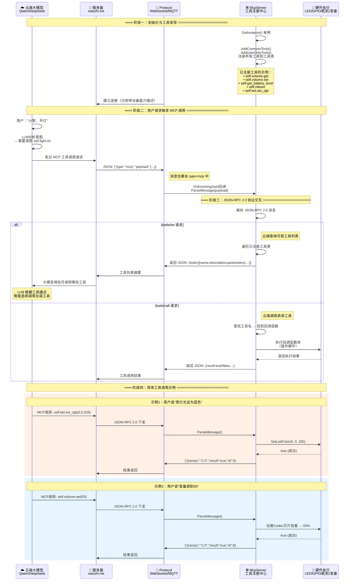

# 小智AI机器人 MCP 协议交互时序图

> MCP (Model Context Protocol) 基于 JSON-RPC 2.0，实现云端对设备的灵活控制

## MCP 协议全流程



## MCP 工具注册示例（设备端代码）

```cpp
// 例1：无参数工具 —— 重启设备
mcp_server.AddTool(
    "self.reboot",               // 工具名
    "重启设备",                   // 描述（给大模型看的）
    PropertyList(),              // 无参数
    [this](const PropertyList&) -> ReturnValue {
        Reboot();
        return true;
    }
);

// 例2：带参数工具 —— 设置RGB灯光
mcp_server.AddTool(
    "self.led.set_rgb",
    "设置LED灯光颜色(rgb)",
    PropertyList({
        Property("r", kPropertyTypeInteger, 0, 255),  // 参数：r, 范围 0-255
        Property("g", kPropertyTypeInteger, 0, 255),  // 参数：g, 范围 0-255
        Property("b", kPropertyTypeInteger, 0, 255)   // 参数：b, 范围 0-255
    }),
    [this](const PropertyList& properties) -> ReturnValue {
        int r = properties["r"].value<int>();
        int g = properties["g"].value<int>();
        int b = properties["b"].value<int>();
        SetLedColor(r, g, b);
        return true;
    }
);
```

## JSON-RPC 2.0 消息格式

| 类型 | JSON 格式 | 说明 |
|------|-----------|------|
| **tools/list** | `{"jsonrpc":"2.0","method":"tools/list","id":1}` | 云端查询设备能力 |
| **tools/call** | `{"jsonrpc":"2.0","method":"tools/call","params":{"name":"self.led.set_rgb","arguments":{"r":0,"g":0,"b":255}},"id":2}` | 云端调用设备工具 |
| **返回结果** | `{"jsonrpc":"2.0","result":true,"id":2}` | 设备返回执行结果 |
| **返回错误** | `{"jsonrpc":"2.0","error":{"code":-32601,"message":"Tool not found"},"id":3}` | 工具不存在 |

## 消息传输路径

```
云端服务器                   设备端
┌──────────┐              ┌─────────────────┐
│ JSON-RPC │              │  type: "mcp"    │
│  2.0     │ ──────────→ │  payload: {...} │
│ 消息     │ ←────────── │                 │
└──────────┘   WebSocket  │  McpServer      │
              或 MQTT     │  ParseMessage() │
                          └─────────────────┘
```
