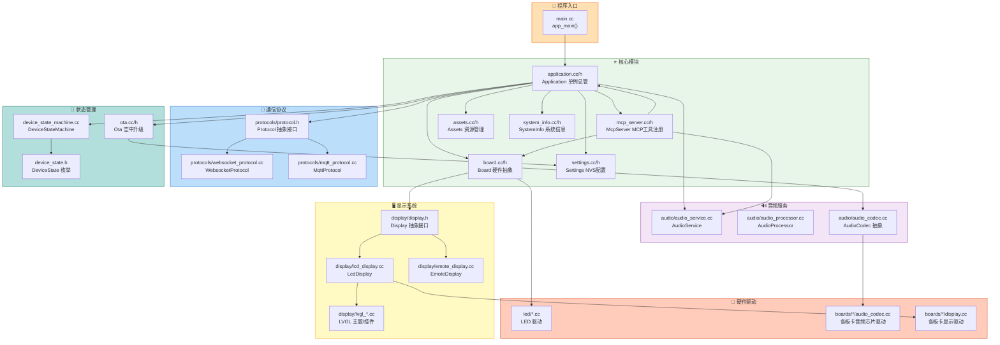
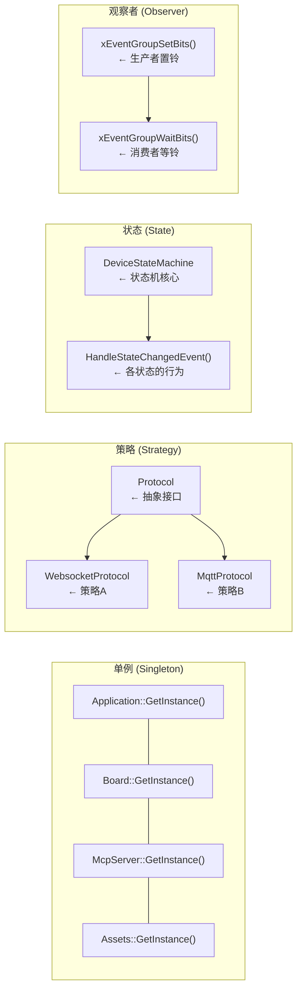

# 小智AI机器人 代码模块依赖关系图

> 此图展示 `main/` 目录下各源码模块的依赖关系与职责

## 模块依赖总图



## 模块职责一览

| 模块 | 文件 | 职责 |
|------|------|------|
| **main.cc** | `main/main.cc` | 程序入口：初始化 NVS，启动 Application |
| **Application** | `application.cc/h` | 全局总管：初始化、主循环、事件分派 |
| **Board** | `board.cc/h` | 硬件抽象：提供 GetDisplay/GetAudioCodec/GetLed/GetNetwork |
| **McpServer** | `mcp_server.cc/h` | MCP 工具注册与调用：AddTool + ParseMessage |
| **Assets** | `assets.cc/h` | 资源管理：Flash分区挂载，字体/emoji/皮肤加载与下载 |
| **Settings** | `settings.cc/h` | NVS 封装：键值对的读写，命名空间管理 |
| **Protocol** | `protocols/protocol.h` | 抽象通信接口：OpenAudioChannel/SendAudio/SendMcpMessage |
| **WebsocketProtocol** | `protocols/websocket_protocol.cc` | WebSocket 协议实现：wss 连接 + 音频流 |
| **MqttProtocol** | `protocols/mqtt_protocol.cc` | MQTT 协议实现：MQTT + UDP 音频传输 |
| **AudioService** | `audio/audio_service.cc` | 音频总管：采集、编码(OPUS)、解码、唤醒词(ESP-SR)、VAD |
| **AudioProcessor** | `audio/audio_processor.cc` | 音频处理引擎：编码/解码调度 |
| **Display** | `display/display.h` | 抽象显示接口：SetStatus/SetEmotion/SetChatMessage |
| **LcdDisplay** | `display/lcd_display.cc` | LCD/OLED 显示实现：基于 LVGL 图形库 |
| **EmoteDisplay** | `display/emote_display.cc` | 无屏版显示实现：表情通过 LED 矩阵 |
| **Ota** | `ota.cc/h` | OTA 升级：版本检查、下载、激活码 |
| **SystemInfo** | `system_info.cc/h` | 系统信息：版本号、UserAgent、内存统计 |

## 关键设计模式



## 依赖层次

```
          main.cc
             │
      Application (应用层)
        ┌────┼────────┐
        │    │        │
    McpServer Board  Protocol
        │    ┌┼┐       │
        │   │ │ │  ┌───┴───┐
        │ Display │ WS     MQTT
        │   │   AudioService
        │   │       │
        └───┴───────┴────── 硬件驱动 (boards/)
```
